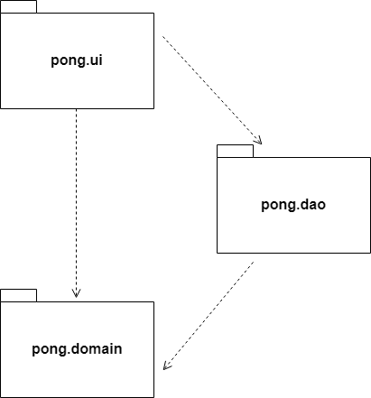

# Arkkitehtuurikuvaus

## Rakenne

Pakkaus _pong.ui_ sisältää JavaFX:n avulla toteutetun käyttöliittymän muodostavat luokat. Pakkaus _pong.domain_ sisältää sovelluslogiikasta vastaavat luokat ja pakkaus _pong.dao_ tiedon pysyväistallennuksesta vastaavan luokan.

## Käyttöliittymä

Sovelluksen käyttöliittymä koostuu seitsemästä eri näkymästä:

* päävalikko
* kontrollit/käyttöohje
* pelaajien nimensyöttö
* pelimuodon valinta
* varsinainen pelinäkymä
* pelin lopputulos
* pistetilastot

Näkymät on toteutettu JavaFX:n Scene-olioina, jotka tarvittaessa näytetään sovellusikkunan muodostavassa Stage-oliossa. Pelinäkymä on toteutukseltaan monimutkaisin, sillä se huolehtii käynnissä olevan pelin reaaliaikaisesta piirtämisestä käyttämällä pakkauksen _pong.domain_ sovelluslogiikkaluokkia ja kutsumalla niiden metodeja.

Pelin lopputuloksen näyttävä näkymä ja pistetilastoista vastaava näkymä käyttävät lisäksi _pong.dao_ pakkauksen luokkaa _SQLScoreDAO_ tietokantaan kirjoittaessaan ja sieltä lukiessaan.

## Sovelluslogiikka

Pelin toiminnallisuudesta vastaa sovelluslogiikkaluokat _Ball_ ja _Paddle_. Käyttöliittymäluokka _PongUI_ käyttää näitä piirtäessään pelinäkymän animaatiota.

Yksittäisten aikarajoitettujen pelien lopputulokset tallennetaan pelin päättyessä tietokantaan, joten pelin pisteiden ja pelaajien nimien hallintaa varten tarvitaan _Score_-luokan tarjoama tietorakenne. Pakkauksesta _pong.dao_ löytyvä _SQLScoreDAO_ käyttää näitä _Score_-olioita tietokannan tiedon jäsentämiseen.

## Tiedon pysyväistallennus

Pakkauksen _pong.dao_ luokka _SQLScoreDAO_ käyttää jdbc:n sqlite-kirjastoa pisteiden tietokantaan tallennukseen ja pisteiden hakemiseen tietokannasta. Tällä hetkellä käyttöliittymä käyttää _SQLScoreDAO_:a suoraan, mutta tavoitteena on ulkoistaa sen käyttö sopivalle sovelluslogiikkaluokalle.

## Tiedostot

Sovellus tallentaa pelattujen aikarajoitettujen pelien lopputulokset tietokantaan. Sovelluksen juurihakemistossa oleva konfiguraatiotiedosto _config.properties_ määrittelee käytettävän tietokannan nimen, joten sitä on mahdollista vaihtaa sovelluksen ulkopuolelta.

Tietokantaan pisteet talletetaan seuraavassa formaatissa:

<pre>
CREATE TABLE score (
        id integer PRIMARY KEY,
        player1 varchar(10),
        player2 varchar(10),
        score1 integer,
        score2 integer
);
</pre>

## Päätoiminnallisuudet

Sovelluksen ydintoiminnallisuuksien kuvaaminen sekvenssikaavioiden avulla on hieman hankalaa, sillä itse pelinäkymä piirretään reaaliajassa käyttäen JavaFX:n AnimationTimer-luokan handle-metodia. Handle-metodi kutsuu jokaisella kierroksella pallon ja tarvittaessa mailojen omia metodeita, joissa suoritetaan tarkistuksia ja tehdään muutoksia niiden sijaintiin näkymässä.

Todellisuudessa pelinäkymästä vastaava käyttöliittymäluokka _PongUI_ luo pallon, mailat ja muut tarvittavat komponentit ja päivittää niitä jatkuvasti. Kaikkien komponenttien ja niiden mahdollisten vuorovaikutusten esittäminen yhtenä sekvenssikaaviona olisi todella hankalaa, joten pyrin hahmottelemaan erikseen muutamia tärkeimpiä toiminnallisuuksia.

**Mailojen liikuttaminen**

Tästä sekvenssikaaviosta on jätetty pois palloon liittyvät metodikutsut, ja pyritty korostamaan vain mailojen liikuttamiseen liittyvää toiminnallisuutta. Päävalikon Play-painiketta klikkaamalla siirrytään pelinäkymään. Pelinäkymässä käytetään hajautustaulua pohjassa pidettyjen näppäinten seuraamiseksi. AnimationTimer-luokan handle-metodissa tarkisteaan onko pelin kannalta merkittäviä näppäimiä painettuna. Jos esimerkiksi 'W' on painettuna, kutsuu _PongUI_ vasemmanpuoleiseen mailaan viittaavan leftPaddle-olion metodia move, jolle on annettu parametriksi -10 kuvaamaan kymmenen askeleen siirtymää ylöspäin näkymän Y-akselilla. Move-metodi itse huolehtii, ettei siirtymä aiheuta mailan poistumista pelialueen ulkopuolelle.