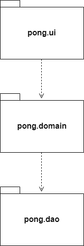
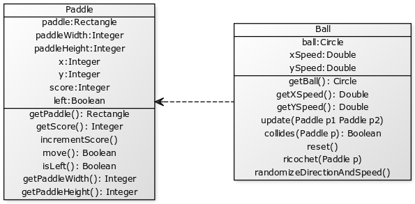
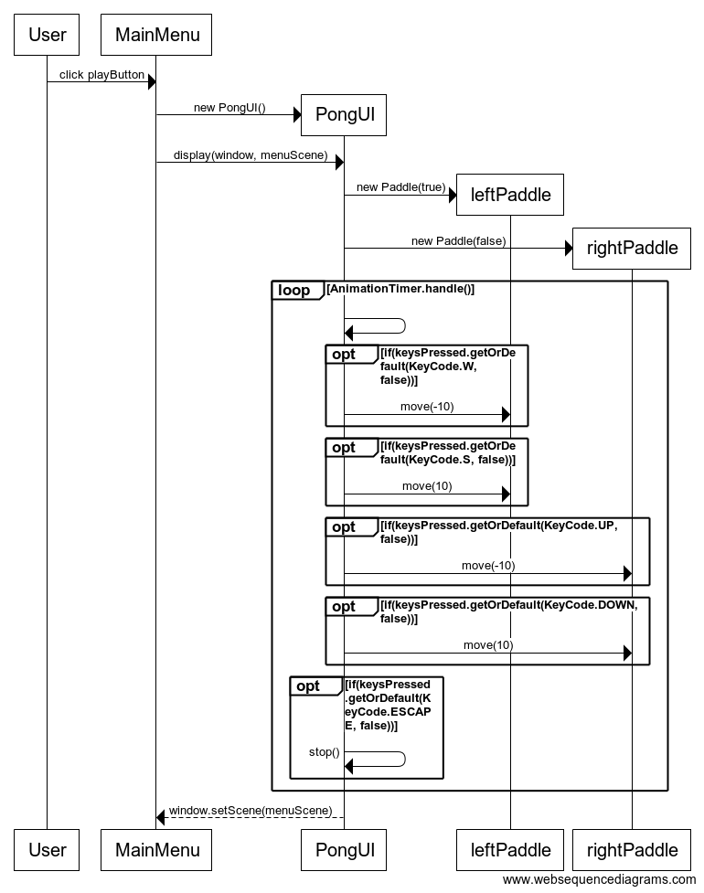

# Arkkitehtuurikuvaus

## Rakenne

Pakkaus _pong.ui_ sisältää JavaFX:n avulla toteutetun käyttöliittymän muodostavat luokat. Pakkaus _pong.domain_ sisältää sovelluslogiikasta vastaavat luokat ja pakkaus _pong.dao_ tiedon pysyväistallennuksesta vastaavan luokan.

## Käyttöliittymä

Sovelluksen käyttöliittymä koostuu seitsemästä eri näkymästä:

* päävalikko
* kontrollit/käyttöohje
* pelaajien nimimerkinsyöttö
* pelimuodon valinta
* varsinainen pelinäkymä
* pelin lopputulos
* pistetilastot

Näkymistä suurin osa on toteutettu JavaFX:n Scene-olioita hyödyntävinä omina luokkinaan, joiden _display_-metodia kustsumalla näkymä asetetaan aktiiviseksi sovellusikkunan muodostavassa Stage-oliossa. Pelinäkymä on toteutukseltaan monimutkaisin, sillä se huolehtii käynnissä olevan pelin reaaliaikaisesta piirtämisestä käyttämällä pakkauksen _pong.domain_ sovelluslogiikkaluokkia ja kutsumalla niiden metodeja.

Pelin lopputuloksen näyttävä näkymä ja pistetilastoista vastaava näkymä ulkoistavat tiedon pysyväistallennukseen liittyvän toiminnallisuuden _pong.domain_ pakkauksen luokalle _ScoreService_. 

## Sovelluslogiikka

Pelin toiminnallisuudesta vastaa sovelluslogiikkaluokat _Ball_ ja _Paddle_. Käyttöliittymäluokka _PongUI_ käyttää näitä piirtäessään pelinäkymän animaatiota.

Yksittäisten aikarajoitettujen pelien lopputulokset tallennetaan pelin päättyessä tietokantaan, joten pelin pisteiden ja pelaajien nimien hallintaa varten käytössä on _Score_-luokan tarjoama tietorakenne. Pakkauksesta _pong.dao_ löytyvä _SQLScoreDAO_ käyttää näitä _Score_-olioita tiedon jäsentämiseen tietokannan ulkopuolella.

_ScoreService_-luokan tehtävä on tarjota käyttöliittymälle _pong.dao_ pakkauksesta löytyvää tiedon tallennukseen ja lukemiseen liittyvää toiminnallisuutta. _ScoreService_ käyttää _ScoreDAO_-rajapinnan toteuttavaa _SQLScoreDAO_:a tiedon tallentamiseksi tietokantaan.

## Tiedon pysyväistallennus

Pakkauksen _pong.dao_ luokka _SQLScoreDAO_ käyttää jdbc:n sqlite-kirjastoa pisteiden tietokantaan tallennukseen ja pisteiden hakemiseen tietokannasta. Käyttöliittymä käyttää sovelluslogiikasta vastaavan _pong.domain_-pakkauksen _ScoreService_-luokkaa _SQLScoreDAO_:n tarjoamien palveluiden kutsumiseen.

## Tiedostot

Sovellus tallentaa pelattujen aikarajoitettujen pelien lopputulokset tietokantaan. Sovelluksen juurihakemistossa oleva konfiguraatiotiedosto _config.properties_ määrittelee käytettävän tietokannan nimen, joten sitä on mahdollista vaihtaa sovelluksen ulkopuolelta.

Otteluiden loppupisteet talletetaan tietokantaan seuraavassa formaatissa:

<pre>
CREATE TABLE score (
        id integer PRIMARY KEY,
        player1 varchar(10),
        player2 varchar(10),
        score1 integer,
        score2 integer
);
</pre>

## Päätoiminnallisuudet

Sovelluksen ydintoiminnallisuuksien kuvaaminen sekvenssikaavioiden avulla on hieman hankalaa, sillä itse pelinäkymä piirretään reaaliajassa käyttäen JavaFX:n AnimationTimer-luokan handle-metodia. Handle-metodi kutsuu jokaisella kierroksella pallon ja tarvittaessa mailojen omia metodeita, joissa suoritetaan tarkistuksia ja tehdään muutoksia niiden sijaintiin näkymässä.

Todellisuudessa pelinäkymästä vastaava käyttöliittymäluokka _PongUI_ luo pallon, mailat ja muut tarvittavat komponentit ja päivittää niitä jatkuvasti. Kaikkien komponenttien ja niiden mahdollisten vuorovaikutusten esittäminen yhtenä sekvenssikaaviona olisi todella hankalaa, joten pyrin hahmottelemaan erikseen muutamia tärkeimpiä toiminnallisuuksia.

**Mailojen liikuttaminen**

Tästä sekvenssikaaviosta on jätetty pois palloon liittyvät metodikutsut, ja pyritty korostamaan vain mailojen liikuttamiseen liittyvää toiminnallisuutta. Päävalikon Play-painiketta klikkaamalla siirrytään pelinäkymään. Pelinäkymässä käytetään hajautustaulua pohjassa pidettyjen näppäinten seuraamiseksi. AnimationTimer-luokan handle-metodissa tarkisteaan onko pelin kannalta merkittäviä näppäimiä painettuna. Jos esimerkiksi 'W' on painettuna, kutsuu _PongUI_ vasemmanpuoleiseen mailaan viittaavan leftPaddle-olion metodia move, jolle on annettu parametriksi -10 kuvaamaan kymmenen askeleen siirtymää ylöspäin näkymän Y-akselilla. Move-metodi itse huolehtii, ettei siirtymä aiheuta mailan poistumista pelialueen ulkopuolelle.

**Pallon liikkuminen**

_PongUI_-luokassa toimiva JavaFX:n AnimationTimer ja sen handle-metodi piirtää ruudulle pallon ja kutsuu jokaisella tulevalla piirtokerralla _Ball_-luokan metodia _update_, joka päivittää pallon suhteellisia X- ja Y-koordinaatteja sen attribuutteina olevien X- ja Y-nopeuksien mukaisesti. _Update_-metodi tekee myös samalla tarkistuksia pallon sijannista. Jos pallon Y-koordinaatti on ylittämässä pelialueen rajat, pallo palautetaan rajojen sisäpuolelle ja sen Y-nopeus käännetään. Jos pallo osuu pelialueen vasempaan tai oikeaan laitaan, pallo palautetaan pelialueen keskelle ja vastakkaiselle pelaajalle lisätään piste.

Jotta pelistä saataisiin mielenkiintoisempi, arvotaan pallon lähtösuunta ja -kulma aina pallon keskelle palauttavan _reset_-metodin kutsun yhteydessä metodin _randomizeDircetionAndSpeed_ avulla. Välttääkseen tilanteen, jossa pallon lähtökulma olisi liian suuri ja pallo jäisi kimpoilemaan ylä- ja alareunojen välille, metodi valitsee lähtökulman 45 ja -45 asteen väliltä ja 50% todennäköisyydellä lähtösuunta on vastakkainen.

Liikkuvan pallon toiminnan esittäminen sekvenssikaaviona on haastavaa, joten jätän sen piirtämättä.

**Pisteiden tallentaminen**

Aikarajoitetun ottelun päätteeksi sovellus siirtyy "Game Over" -näkymään, jossa lopullinen pistetilanne myös esitetään. Pakkauksesta _pong.ui_ löytyvä käyttöliittymäluokka _GameOver_ luo lopputulosta vastaavan _Score_-olion ja uuden _SQLScoreDAO_-olion. _SQLScoreDAO_:n konstruktorissa haetaan metodilla _getScoreFile_ sovelluksen suoritushakemistosta tiedoston _config.properties_ sisältämä tieto luotavan tietokannan tiedostonimestä, ja luodaan kyseinen tietokanta, jollei sellaista ole jo olemassa. Tietokantaan luodaan myös tarvittava _Score_-taulu, mikäli sitä ei ole jo luotu.

_GameOver_ luo myös _ScoreService_-olion, jolle konstruktorin kautta injektoidaan aiemmin luotu _SQLScoreDAO_. _ScoreService_ käyttää injektoidun DAO:n metodeja tarjotakseen käyttöliittymälle sen tarvitseman tiedon tallennuspalvelun.