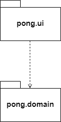

# Arkkitehtuurikuvaus

## Rakenne

## Sovelluslogiikka

## Päätoiminnallisuudet

Sovelluksen ydintoiminnallisuuksien kuvaaminen sekvenssikaavioiden avulla on hieman hankalaa, sillä itse pelinäkymä piirretään reaaliajassa käyttäen JavaFX:n AnimationTimer-luokan handle-metodia. Handle-metodi kutsuu jokaisella kierroksella pallon ja tarvittaessa mailojen omia metodeita, joissa suoritetaan tarkistuksia ja tehdään muutoksia niiden sijaintiin näkymässä.

Todellisuudessa pelinäkymästä vastaava käyttöliittymäluokka _PongUI_ luo pallon, mailat ja muut tarvittavat komponentit ja päivittää niitä jatkuvasti. Kaikkien komponenttien ja niiden mahdollisten vuorovaikutusten esittäminen yhtenä sekvenssikaaviona olisi todella hankalaa, joten pyrin hahmottelemaan erikseen muutamia tärkeimpiä toiminnallisuuksia.

**Mailojen liikuttaminen**

Tästä sekvenssikaaviosta on jätetty pois palloon liittyvät metodikutsut, ja pyritty korostamaan vain mailojen liikuttamiseen liittyvää toiminnallisuutta. Päävalikon Play-painiketta klikkaamalla siirrytään pelinäkymään. Pelinäkymässä käytetään hajautustaulua pohjassa pidettyjen näppäinten seuraamiseksi. AnimationTimer-luokan handle-metodissa tarkisteaan onko pelin kannalta merkittäviä näppäimiä painettuna. Jos esimerkiksi 'W' on painettuna, kutsuu _PongUI_ vasemmanpuoleiseen mailaan viittaavan leftPaddle-olion metodia move, jolle on annettu parametriksi -10 kuvaamaan kymmenen askeleen siirtymää ylöspäin näkymän Y-akselilla. Move-metodi itse huolehtii, ettei siirtymä aiheuta mailan poistumista pelialueen ulkopuolelle.