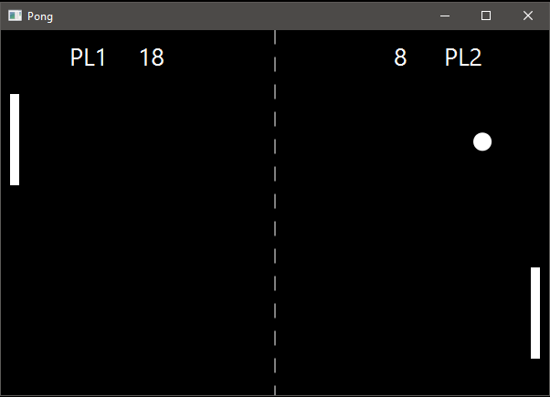

# Käyttöohje

Lataa tiedosto [pong.jar](https://github.com/TimoJarvenpaa/ot-harjoitustyo/releases/tag/v1.1)

## Konfigurointi

Ohjelma olettaa, että sen käynnistyshakemistossa on konfiguraatiotiedosto _config.properties_, joka määrittelee pistetilastot tallettavan tietokannan tiedostonimen. Konfiguraatiotiedoston sisältö on seuraavanlainen

```
scoreFile=score.db
```

Luotavan tietokannan nimi on nyt _score.db_. Jos sovelluksen käyttämän tietokannan nimen haluaa vaihtaa, onnistuu se editoimalla _config.properties_-tiedostoa.

## Ohjelman käynnistäminen

Ohjelma käynnistetään komennolla
```
java -jar pong.jar
```

## Päävalikko

Sovelluksen päävalikosta voi valita **Play**, **Controls**, **High-Scores** tai **Quit**.


### Play

*Play*-nappia painamalla siirrytään näkymään, jossa syötetään molemmille pelaajille nimet. Nimi ei saa sisältää välilyöntejä, ja sen täytyy olla 3 merkkiä pitkä. Jos nimi on pidempi, sen kolme ensimmäistä merkkiä muodostaa pelaajan nimen. Nimien syöttämisen jälkeen tulee painaa *Continue*-painiketta.


Seuraavassa näkymässä valitaan pelimuoto. *Endless Mode* on aikarajoittamaton pelimuoto, josta voi poistua painamalla *ESC*-näppäintä. *Time Limit (60 seconds)* tarjoaa minuutin mittaisen pelin, jonka päätteeksi pelin lopputulos esitetään Game Over -ruudussa. Lopputulos tallennetaan lisäksi sovelluksen käyttämään tietokantaan.


Varsinaisessa pelinäkymässä vasemmanpuoleista mailaa voi liikuttaa ylöspäin näppäimistön W-painikkeella ja alaspäin S-painikkeella. Oikeanpuoleista mailaa liikutetaan vastaavasti ylös- ja alaspäin osoittavilla nuolinäppäimillä. Käynnistyneen pelin voi keskeyttää painamalla ESC-näppäintä, joilloin siirrytään takaisin päävalikkoon. Mikäli aikarajoitettu peli keskeytetään, sen pisteitä ei tallenneta tietokantaan.



### Controls

*Controls*-nappia painamalla pääsee katselemaan pelissä käytettäviä kontrolleja ja niitä vastaavia näppäinkomentoja.


### High-Scores

*High-Scores*-nappia painamalla pääsee tarkastelemaan aiempien aikarajoitettujen pelien pistetilastoja, mikäli sellaisia löytyy. Pisteet haetaan sovelluksen käyttämästä tietokannasta.


### Quit

*Quit*-nappia painamalla sovellus sulkeutuu.

