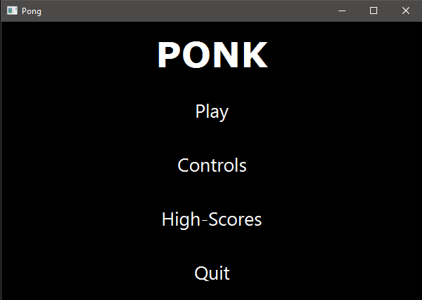
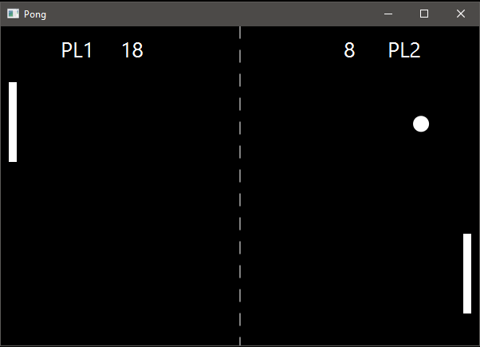

# Vaatimusmäärittely

## Sovelluksen tarkoitus

Sovelluksen avulla kaksi käyttäjää voi pelata jaetulla näppäimistöllä klassisen Pong-videopelin kaltaista yksinkertaista peliä. Pelissä osapuolet liikuttavat pelikentän oikealla tai vasemmalla puolella olevia "mailoja" pystyakselin suuntaisesti tarkoituksenaan kerätä pisteitä kimmottamalla pelikentällä liikkuva pallo vastustajan puoleiseen laitaan ja torjumalla vastapuolen yrityksiä tehdä maaleja.

## Käyttöliittymä

Sovelluksen kaksi tärkeintä näkymää ovat sen päävalikko ja itse pelinäkymä.

Sovellus aukeaa käynnistyessään päävalikkonäkymään, josta on mahdollista siirtyä muihin näkymiin.

## Sovelluksen tarjoama toiminnallisuus

* käyttäjä voi aloittaa ja keskeyttää pelin
* pelaajille annetaan nimimerkit mahdollista tulosten tallennusta varten
* pelissä on kaksi pelitilaa, aikarajoitetettu minuutin mittainen peli ja päättymätön pelitila
* pelissä molempia mailoja liikutetaan näppäimistön avulla, mikä mahdollistaa kaksinpelin
* liikkuvan pallon osuminen mailaan tai pelikentän reunoihin aiheuttaa asianmukaisen kimpoamisen
* pallon osuessa vastustajan päätyyn, maalin tekijälle lisätään piste ja pallo palautuu keskelle pelialuetta
* pallon lähtösuunta ja -kulma arvotaan joka kerta kun pallo palautuu keskelle maalin tai uuden pelin aloituksen johdosta
* aikarajoitetun pelin päätteeksi ottelun pistetilanne tallennetaan tietokantaan
* aikaisempien otteluiden tuloksia voi tarkastella päävalikosta löytyvän High-Score -näkymän kautta

## Jatkokehitysideoita

* yksinkertainen tekoäly, joka mahdollistaisi myös yksinpelin
* asetusvalikko, josta mm. sovellusikkunan, mailojen ja pallon kokoa voisi vaihtaa